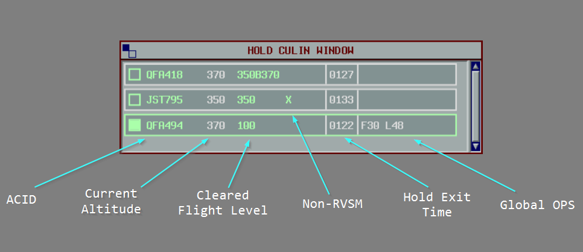
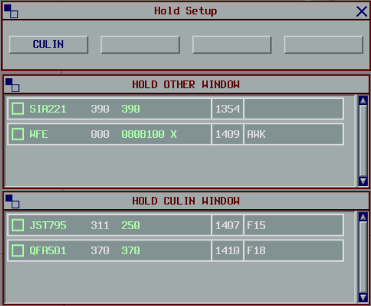

--8<-- "includes/abbreviations.md"

## Background

The Hold plugin replicates the Eurocat Hold window and functionality, helping Enroute and Terminal controllers manage traffic in holding stacks or performing airwork over a specified location.

<figure markdown>
{ width="600" }
</figure>

## Initiating a Hold

To initiate a hold, enter the hold details into the Label Data.
The hold information should be formatted as `H\RIVET`, where `RIVET` is the name of the holding waypoint.
The waypoint name can be shortened to as little as three characters (e.g. `H\RIV`).

An exit time can be specified by appending it to the holding point name, e.g. `H\RIVET\29` to depart `RIVET` at 29-minutes past the hour.

The exit time can be adjusted directly from the list or by modifying the label, and can be cleared by middle-clicking it in the list.

!!! note
    The exit time is optional and informational only.
    Due to limitations in the vatSys SDK, the plugin does not modify the flight plan or the estimates of subsequent waypoints.

## Terminating a Hold

The hold can be cancelled by middle-clicking the ACID in the hold list, or by removing the details from the Label Data.

## Hold Lists

The hold list displays flights ordered by their CFL.

When a block clearance has been issued, the CFL is displayed as `xxxByyy`, where `xxx` is the lower level, and `yyy` is the upper level.

An `X` will be displayed if the aircraft is non-RVSM.

The hold entry and exit times are displayed in the label. The exit can be adjusted by clicking on it to select a new exit time, or cleared by middle-clicking it.

The `OP_DATA` can also be viewed and edited from the hold label.

<figure markdown>
{ width="700" }
</figure>

## Configuring Lists

Up to 4 holding lists are available.
When a hold is initiated at a waypoint that does not already have a list, one is created automatically.
When all holds at that waypoint are removed, the list is freed and the slot becomes available again.

Lists can also be configured manually via Tools > Hold Setup.
Manually configured lists are not freed automatically; they must be cleared via the Hold Setup window.

Any aircraft holding at a waypoint when all 4 lists are already occupied will be placed in the `OTHER` list.

<figure markdown>
{ width="550" }
</figure>
