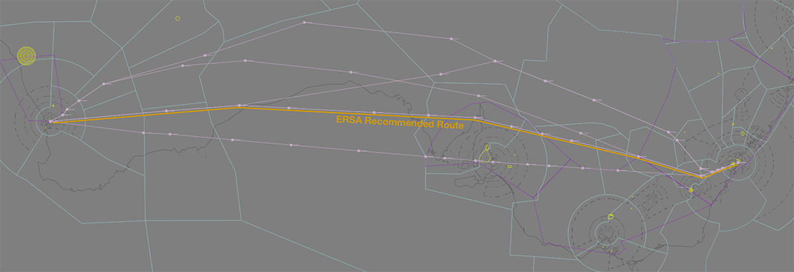
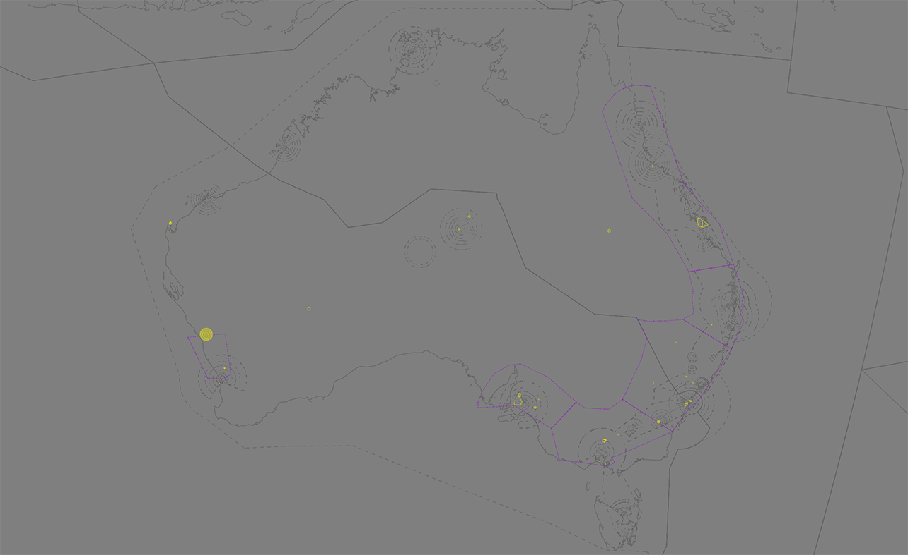

--8<-- "includes/abbreviations.md"

## Overview
When managing aircraft traffic, the route an aircraft takes is more important than its destination.
 
In real-life, route selection for air traffic is a complex exercise, involving multiple levels of airline management, ATS review, and regulatory compliance.

On VATSIM, we can use a variety of online tools and control techniques to simulate realistic and efficient operations through accurate route selection.

!!! tip
    This page provides guidance to controllers when validating routes as part of their airways clearance. The VATPAC [Pilot Procedures page](https://pilots.vatpac.org/flight-planning/routeselection/) contains a useful guide to route selection, designed for pilots.

## Airways
The Australian and Pacific FIRs all contain an extensive network of **airways**: designated routes between navigation points used by aircraft during their flight. Airways are designated for use within particular flight level bands, based on their classification.

- **Low Altitude Airways** are designated for aircraft planned AT OR BLW `F200`.
- **High Altitude Airways** are designated for aircraft planned AT OR ABV `F200`.

Many airways are designated as **both** high altitude and low altitude airways, and can be planned at all levels. Airways can be further restricted as either "one-way" or "two-way". One-way airways are used extensively throughout the Australian airway network to separate departure and arrivals at major aerodromes into separate segregated streams of traffic.

!!! abstract "Reference"
    Airways are published on the ERC High and ERC Low charts available on the [Airservices Australia](https://www.airservicesaustralia.com/aip/aip.asp).

## Flight Plan Requirements
The `ERSA - FLIGHT PLAN REQUIREMENTS` outlines requirements for flight plans, suggested flight planning options and route restrictions. These requirements, listed in the form of route segments and preferred routes, are designed to improve traffic flow, reduce controller workload, and provide predictable flight paths.

Most major airports have specific route segment requirements which ensure departures and arrivals navigate via SID/STAR termini and their wider airway network.
    
### Recommended Routes
The ERSA also includes a collection of route planning options for aircraft travelling between regular aerodrome pairs. Aircraft travelling between an aerodrome pair are generally required to file via the route option listed ([with some exceptions](#user-preferred-routing).

Separate route options for jet aircraft and non-jet aircraft may be listed, in addition to alternate routes available during times of [SUA activation](../sua/#activation-of-sua).

!!! example  
    The recommended route for jet aircraft travelling from YMML to YSSY is `DCT ML H129 DOSEL Y59 TESAT DCT`.
    
    The recommended route for non-jet aircraft travelling from YMML to YSSY is `DCT ML H129 DOSEL W569 AY W817 ANNKY W113 ANKUB TESAT DCT`

Not all airport pairings have a route option listed in the ERSA, and some airport pairings do not contain options for all aircraft types. Aircraft travelling between aerodromes without a route option may file any route as long as it is compliant with the other listed flight plan requirements.

#### SIDs/STARs
Aircraft should not include SIDs and STARs on their flight plans in Australia as these are issued by controllers: the SID by ACD during airways clearance, and the STAR while enroute by the relevant controller.

!!! example
    Aircraft may choose to file the route listed above as `DCT DOSEL Y59 RIVET DCT`, omitting the airway segments between `ML-DOSEL` and `RIVET-TESAT`.
    
    These can be considered to be equivalent routes, as those missing segments would be altered through the issuing of the DOSEL SID and RIVET STAR.

### User Preferred Routes
**User Preferred Routes** (UPR) are an alternative to navigating solely via published airways. With UPRs, operators choose flexible flight paths customised to specific weather patterns and aircraft performance to optimise fuel efficiency and travel time. UPRs can be constructed using any combination of published enroute waypoints, navaids, and coordinates to connect aircraft to published route segments.

<figure markdown>
{ width="600" }
    <figcaption>Example of realworld UPRs vs published route between YPPH and YSSY. Long-distance flights gain the most benefit from UPRs as they seek to avoid harsh headwinds or exploit strong tailwinds.</figcaption>
</figure>

The real-world list of requirements for UPRs are documented in the [Off Air Routes Planning (OARP) Manual](https://www.airservicesaustralia.com/industry-info/flight-briefing/off-air-route-flight-planning-options/), which contains a comprehensive list of conditions, and areas where UPRs are not permitted (called [UPR Exclusion Zones](#upr-exclusion-zones).

#### UPR Exclusion Zones
**UPR Exclusion Zones** are areas where aircraft are not permitted to use UPRs. These zones exist predominantly on the 'J-curve', and exist to ensure the orderly flow of traffic in congested and complex airspace.

<figure markdown>
{ width="600" }
    <figcaption>UPR Exclusion Zones (*in purple*)</figcaption>
</figure>

Aircraft travelling in these zones must adhere to stricter planning requirements and follow [recommended route options](#recommended-routes), where available.

!!! example
    An aircraft flying from YSSY to YMML must use a recommended route as their flight will entirely remain within a UPR Exclusion zone.
    
    An aircraft flying from YSSY to YPPH must remain on a recommended route until leaving the exclusion zone, whereupon they may fly their UPR until reaching the exclusion zone around Perth.
    
    An aircraft flying between YBRM and YPDN, entirely outside the exclusion zone, would not be required to use a recommended route, but would still be required to adhere to any other planning requirements relevant to their origin and destination.

## Validating Routes
Before issuing an airways clearance, controllers should ensure the aircraft's filed route complies with all applicable flight plan requirements.

This includes:

- Comparing the filed route to the [recommended route](#recommended-routes);
- Checking [UPR](#user-preferred-routing) segments are outside any [UPR Exclusion Zones](#upr-exclusion-zones)
- Ensuring filed flight plans are compliant with [route segment requirements](#flight-plan-requirements);
    
!!! tip
     OzStrips can help controllers [detect potential route errors](../../client-towerstrips/#flight-plan-errors) by highlighting routes that don't match recommended routes listed in the ERSA, however it is not infallible.
    
    Some **valid routes may flag** where the route deviates from FPR guidance. Some **invalid routes may not flag** where no FPR guidance exists for that aerodrome pairing.

    ACD controllers must ensure they continue to [check each route](#validating-routes) for errors regardless of strip error status.

    Where a valid route has been flagged as invalid, the warning can be removed by [middle clicking](../client/towerstrips.md#flight-plan-errors).

Where a route is not compliant, an [amended route](#route-amendments) should be issued.

!!! note
    In the real world, flight plans are reviewed by specialists, and flight plans for RPT traffic are almost always compliant by the time they reach ATC. In the online environment, validating routes can be a challenging and time-consuming exercise. Pilots are unlikely to be aware of the complete set of route requirements or have outdated AIRAC data, and may have difficulty adjusting to a reroute on short notice.
    
   Controllers should work with pilots patiently to maximise route compliance. Where a pilot is unable to comply with a reroute controllers should, workload permitting, try to find an alternative route that minimises conflict with other traffic.
   
   In all cases, controllers should display professional behaviour to other controllers and pilots when validating routes and providing amended routes.
   
    
### Route Amendments
When an aircraft is being cleared via an amended route, the controller must communicate the amendment to the pilot, ending with either the destination, or the point where the amended route rejoins the pilot's filed route, followed by FLIGHT PLANNED ROUTE.

!!! phraseology
    *VOZ845 has filed a non-compliant route for their YMML-YSSY flight: `DCT ML DCT TESAT DCT`. ML ACD wishes to amend their flightplan to follow the recommended route, DOSEL Y59 TESAT DCT.*  
             
    **ML ACD**: "VOZ845, cleared to *Kingsford Smith* via amended DOSEL Y59 TESAT..."  
    
!!! phraseology
    *QFA454 has also filed a non-compliant route for their YMML-YSSY flight: `DCT ML H50 MNG DCT CULIN Y59 TESAT DCT`. ML ACD only needs to amend the non-compliant segment of their route.* 
         
    **ML ACD**: "QFA454, cleared to *Kingsford Smith* via amended DOSEL Y59 CULIN, thence flight planned route..."
    

